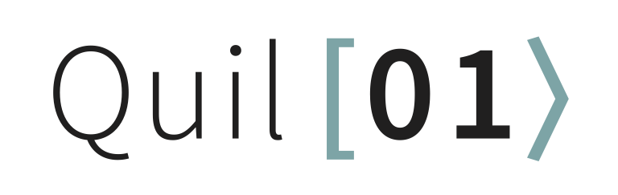

# Quil: A Portable Quantum Instruction Language

This repository contains the reference specification for the Quil language in
addition to some useful extras outlined below.

Repository layout:
- `/examples`: examples of Quil
- `/grammars`: example grammars used by parser generators
- `/paper`: the source and rendered files for the Quil reference paper, by
Smith et al
- `/rfcs`: proposals for adding features or changing Quil
- `/spec`: the Quil language specification

## Known Usages

The following is a list of known usages of the Quil language. Open a pull
request to add your own to this list.

Language bindings:
- [PyQuil](https://github.com/rigetti/pyquil): A library for easily generating
Quil programs to be executed using the Rigetti Forest SDK

Compilers:
- [quilc](https://github.com/rigetti/quilc): The Rigetti optimizing Quil
compiler

Simulators:
- [qvm](https://github.com/rigetti/qvm): The Rigetti high-performance quantum
virtual machine
